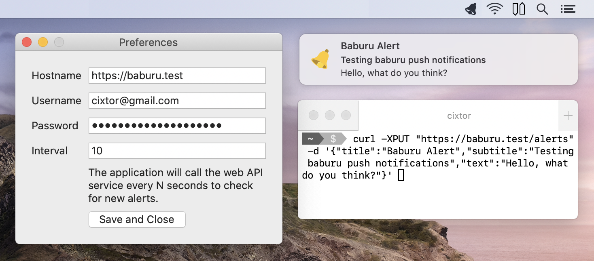

# Baburu (バブル)

Minimalistic, native and open-source push notification service for macOS written in Swift 5.

The application is a [Menu Extra Bar](https://developer.apple.com/design/human-interface-guidelines/macos/extensions/menu-bar-extras/), also known as a “menu bar app”. It allows you to configure access to a self-hosted web API service that stores and delivers JSON objects that are immediately translated into native user notifications. The application calls the web API service every N seconds, where N is a number between 1-86400 (inclusive). The alerts are pushed to the [Notification Center](https://support.apple.com/en-ca/HT204079) which means you have full control over their appearance and visibility. You can also pause the alerts using [Do Not Disturb](https://support.apple.com/en-ca/guide/mac-help/mchl999b7c1a/mac).
